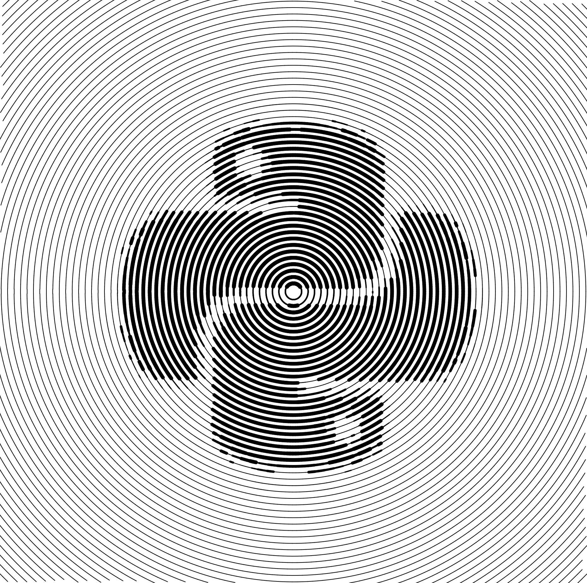
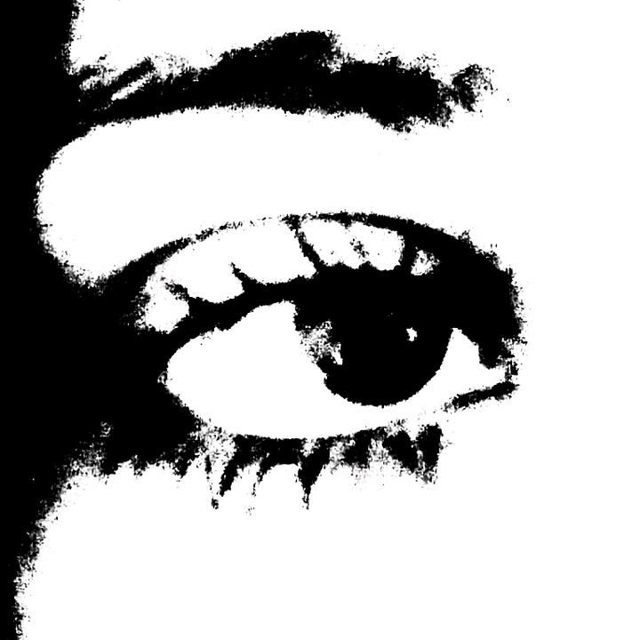
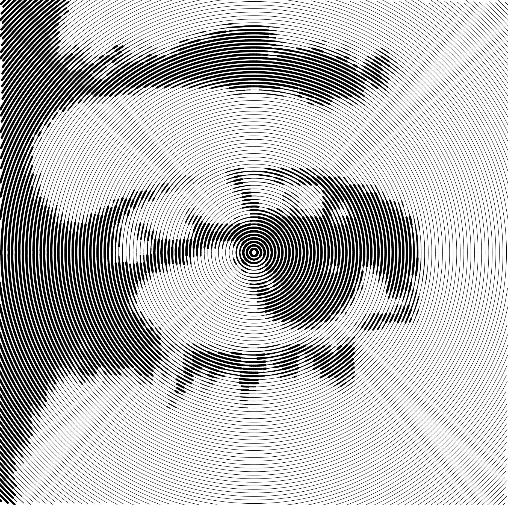
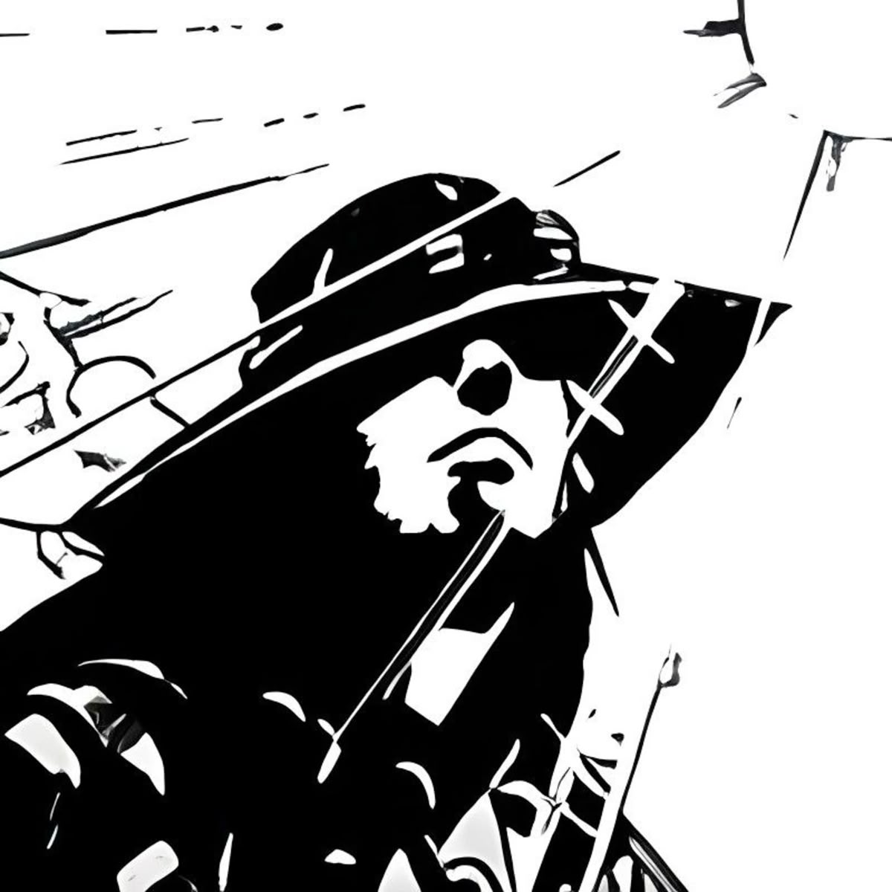
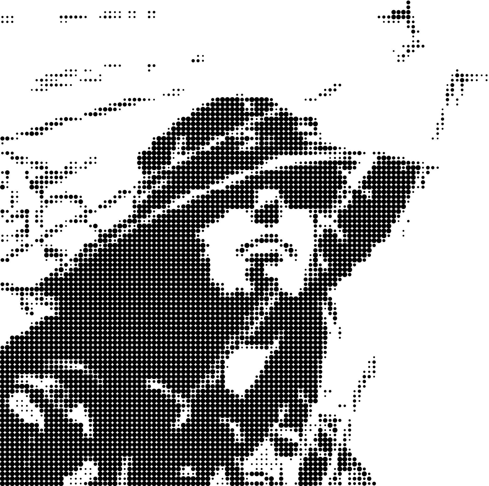

    <h1>Pic-Thon</h1>
    <picture>
        <source media="(prefers-color-scheme: dark)" srcset="assets/logo-dark.png">
        <source media="(prefers-color-scheme: light)" srcset="assets/logo-light.png">
        
    </picture>
    
A Python project for making stylized images

## Overview
Pic-thon is a Python-based application designed to transform ordinary images into stylized artworks using various filters and effects.

## Screenshots

    

        
        
    

    
Circular 100

     
    

        
        
    

    
Halftone 100

