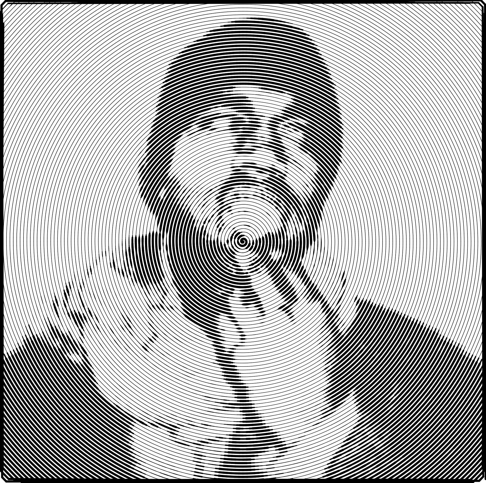

<div align="center">
    <picture>
        <source media="(prefers-color-scheme: dark)" srcset="assets/logo-dark.png">
        <source media="(prefers-color-scheme: light)" srcset="assets/logo-light.png">
        
    </picture>
    <h1>Pic-Thon</h1>
    <p>A Python project for making stylized images</p>
</div>

## Screenshots
<div align="center">
    <div style="display: flex; justify-content: center; flex-wrap: wrap;">
        
        
    </div>
    <p>Circular, 100 strokes, 256x256 size</p>
    <br />
    <div style="display: flex; justify-content: center; flex-wrap: wrap;">
        
        
    </div>
    <p>Halftone, 100 strokes, 128x128 size</p>
    <br />
    <div style="display: flex; justify-content: center; flex-wrap: wrap;">
        
        
    </div>
    <p>Spiral, 100 strokes, 256x256 size</p>
</div>

## Overview

Pic-Thon is a small Python utility that converts images into stylized artworks by rendering stroke-based patterns (horizontal, vertical, diagonal, circular, radial, spiral, halftone, and more). The core renderer lives at `pic-thon/main.py` and exposes a command-line interface so you can batch-process images or experiment interactively.

This repository provides a set of stroke renderers and a lightweight CLI to control direction, number of strokes, output resolution and more.

## Features

- Multiple stroke patterns: horizontal, vertical, diagonal (including reversed variants), crosshatch, radial, circular, spiral, halftone.
- Adjustable stroke counts and output resolution.
- Simple CLI for one-off runs or scripts.
- Outputs standard image files (PNG/JPEG) using Matplotlib.

## Requirements

- Python 3.8+ (3.10/3.11 recommended)
- The following Python packages:
  - Pillow (PIL)
  - NumPy
  - Matplotlib

Install the packages with pip:

- Inline installation:
  - `pip install pillow numpy matplotlib`

(You can also create a virtual environment and install into it.)

## Installation

1. Clone the repo (or copy the `pic-thon` directory into your workspace).
2. Create and activate a virtual environment (optional but recommended):

   - macOS / Linux:
     - `python3 -m venv venv`
     - `source venv/bin/activate`
   - Windows (PowerShell):
     - `python -m venv venv`
     - `.\venv\Scripts\Activate.ps1`

3. Install dependencies:

   - `pip install pillow numpy matplotlib`

4. Ensure the main script is executable (optional):
   - `chmod +x pic-thon/main.py`

## Usage

Run the renderer from the repository root (or the directory containing the `pic-thon` folder). The primary entrypoint is `pic-thon/main.py`.

Basic syntax:

- Required:
  - `-i/--input` path to the input image file.
- Optional:
  - `-o/--output` output file path. If omitted, an output filename is auto-generated next to the input file.
  - `--size` size used to build the internal lightness grid (square). Default: 64.
  - `-s/--strokes` number of strokes to generate (controls level of detail). Default: 100.
  - `-d/--direction` pattern/direction to render (default: `circular`).
  - `--bg` background color (default: white, `#FFFFFF`).
  - `--fg` foreground color (default: black, `#000000`).

```bash
python3 pic-thon/main.py -i input/01.jpg -o output/01_circular.jpg -d circular -s 100 --size 128 # circular pattern with 100 strokes and 128x128 grid
python3 pic-thon/main.py -i input/portrait.jpg -o out/portrait_spiral.png -d spiral -s 400 --size 256 # spiral pattern with 400 strokes and 256x256 grid
```

If `-o/--output` is not provided, Pic-Thon will generate an output filename in the input file's directory using the pattern:

`<input_stem>_output_<direction>_<strokes>.<original_ext>`

For example:
- Input: `input/01.jpg`
- Direction: `circular`
- Strokes: `100`
- Auto output: `input/01_output_circular_100.jpg`

## Examples

- Batch scripts:
  - Use a simple shell loop to generate multiple variants:

    ```bash
    for f in input/*.jpg; do python3 pic-thon/main.py -i "$f" -d circular -s 120; done
    ```

- Experimenting interactively:
  - Try different `--size` values (grid resolution) and `--strokes` counts — larger values increase rendering time but can create more detailed or subtler strokes.

## License

This project is provided under the [MIT License](./LICENSE).
